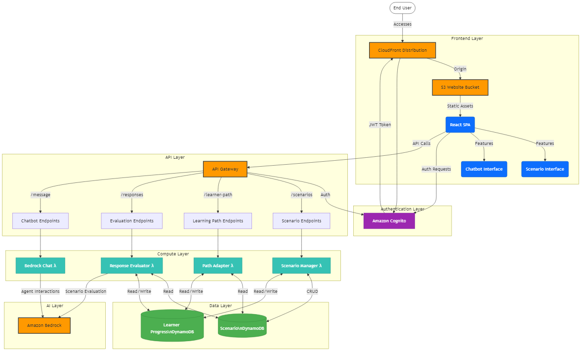

# Glean Technical Enablement Simulator

A comprehensive cloud-based platform that helps GTM (Go-to-Market) and support teams practice and improve their technical knowledge through AI-powered scenario simulations. This application leverages AWS CDK to deploy a complete solution with frontend and backend components.

## Architecture Overview



### Key Components

1. **Frontend Application**
   - React-based SPA (Single Page Application)
   - Hosted on S3 and served via CloudFront
   - Features an interactive chatbot interface
   - Scenario selection and simulation interface

2. **Backend Services**
   - Authentication via Amazon Cognito
   - REST API through Amazon API Gateway
   - Serverless processing with AWS Lambda
   - Data persistence in Amazon DynamoDB
   - AI-powered response evaluation with Amazon Bedrock

3. **AI Integration**
   - Scenario responses evaluated by Bedrock models
   - Interactive chatbot powered by Amazon Bedrock agents
   - Adaptive learning paths based on user performance

## Component Interaction Flow

1. Users authenticate through Cognito
2. Upon login, users select technical scenarios from the UI
3. As users progress through scenarios, responses are sent to the API
4. Lambda functions process user inputs:
   - Response Evaluator uses Bedrock to assess technical accuracy
   - Scenario Manager tracks progress and serves content
   - Path Adapter personalizes the learning experience
5. The chatbot interface provides real-time assistance using Bedrock agents

## Prerequisites

- [Node.js](https://nodejs.org/) v18.x or later
- [AWS CLI](https://aws.amazon.com/cli/) configured with appropriate permissions
- [AWS CDK](https://aws.amazon.com/cdk/) v2 installed globally (`npm install -g aws-cdk`)
- [AWS Account](https://aws.amazon.com/) with access to Amazon Bedrock
- For AWS SSO users, SSO credentials configured

## Deployment Instructions

### Initial Setup

```bash
# Clone the repository (if applicable)
git clone <repository-url>
cd adaptive_scenario_agent

# Install dependencies
npm install

# Install frontend dependencies
cd frontend
npm install
cd ..
```

### Environment Configuration

Create a `.env` file in the project root with the following variables (optional):

```
BEDROCK_AGENT_ID=your-agent-id
BEDROCK_AGENT_ALIAS=your-agent-alias
```

### Full Deployment

Deploy the complete stack including all backend services and frontend:

```bash
# Build TypeScript files
npm run build

# Deploy the CDK stack
./deploy.sh

# With AWS profile and Bedrock agent configuration
./deploy.sh --profile my-aws-profile --agent-id your-agent-id --agent-alias your-agent-alias
```

### Frontend-Only Updates

After making frontend changes, you can update just the frontend:

```bash
# Build the React app
cd frontend
npm run build
cd ..

# Deploy frontend using the Node.js script (recommended for AWS SSO users)
node ./frontend-deploy-cli.js --profile my-aws-profile

# OR use the shell script alternative
./deploy-frontend.sh --profile my-aws-profile
```

### AWS SSO Authentication

For AWS SSO users, a helper script is provided to simplify authentication:

```bash
# Run the helper script (it will prompt for a profile if not specified)
source ./aws-sso-helper.sh

# Or specify a profile directly
source ./aws-sso-helper.sh --profile my-aws-profile

# After authentication, run other commands that require AWS credentials
node scripts/seed-scenarios.js
```

### Data Seeding

Load sample scenarios into the DynamoDB table:

```bash
# Set environment variables using values from cdk-outputs.json
export SCENARIO_TABLE_NAME=$(grep ScenarioTableName cdk-outputs.json | cut -d'"' -f4)

# Seed scenarios
node scripts/seed-scenarios.js --profile my-aws-profile
```

## Project Structure

```
/
├── bin/                     # CDK application entry point
│   └── app.ts               # Main CDK app definition
├── lib/                     # CDK infrastructure code
│   └── glean-stack.ts       # Main stack definition with all resources
├── lambda/                  # Lambda function code
│   ├── scenario-manager/    # Manages scenarios in DynamoDB
│   ├── response-evaluator/  # Evaluates responses using Bedrock
│   ├── path-adapter/        # Adapts learning paths based on progress
│   ├── bedrock-chat/        # Handles chatbot interactions
│   └── agent-handler/       # Processes Bedrock agent interactions
├── frontend/                # React frontend application
│   ├── src/                 # Source code
│   │   ├── components/      # React components
│   │   │   └── ChatBot/     # Chatbot interface components
│   │   └── contexts/        # React context providers
│   ├── public/              # Public assets
│   └── package.json         # Frontend dependencies
├── scripts/                 # Utility scripts
│   └── seed-scenarios.js    # Script to populate scenarios in DynamoDB
├── deploy.sh                # Main deployment script
├── deploy-frontend.sh       # Frontend-only deployment script
├── frontend-deploy-cli.js   # Node.js CLI for frontend deployment
├── aws-sso-helper.sh        # Helper script for AWS SSO authentication
└── cdk.json                 # CDK configuration
```

## Local Development

### Backend

```bash
# Synthesize CloudFormation template for inspection
npm run cdk synth

# Compare deployed stack with current state
npm run cdk diff
```

### Frontend

```bash
# Start local development server
cd frontend
npm start

# Run tests
npm test

# Build for production
npm run build
```

### Testing Lambda Functions Locally

Install the AWS SAM CLI for local Lambda testing:

```bash
# Install SAM CLI
npm install -g aws-sam-cli

# Test a Lambda function locally
sam local invoke ResponseEvaluatorLambda --event events/test-event.json
```

## Chatbot Integration

The application includes a floating chatbot interface powered by an Amazon Bedrock agent.

### Chatbot Features

- Powered by [react-chatbot-kit](https://www.npmjs.com/package/react-chatbot-kit)
- Connects to Amazon Bedrock for intelligent responses
- Session management with UUID-based identifiers
- Responsive design with custom styling
- Floating interface that can be minimized/maximized

### Customizing the Chatbot

Customize the chatbot appearance and behavior in these files:

- `frontend/src/components/ChatBot/index.jsx` - Main component structure
- `frontend/src/components/ChatBot/config.jsx` - Configuration settings
- `frontend/src/components/ChatBot/css_overrides.css` - General styling
- `frontend/src/components/ChatBot/custom_components.css` - Custom component styling
- `frontend/src/components/ChatBot/ActionProvider.jsx` - Message handling logic

## Monitoring and Debugging

- CloudWatch Logs for Lambda function logs
- CloudWatch Metrics for performance monitoring
- X-Ray for distributed tracing (can be enabled for API Gateway and Lambda)

Access CloudWatch Logs for Lambda functions:

```bash
aws logs get-log-events \
  --log-group-name "/aws/lambda/GleanTechnicalEnablementStack-ResponseEvaluatorLambda-XXXX" \
  --log-stream-name "YYYY-MM-DD/..." \
  --profile my-aws-profile
```

## Security Considerations

- Authentication is handled by Amazon Cognito
- API Gateway endpoints are secured with Cognito authorizers
- S3 bucket is not publicly accessible - content is served via CloudFront
- CloudFront uses Origin Access Control (OAC) for secure S3 access
- IAM roles follow principle of least privilege

For production deployments, consider:
- Setting up WAF for additional protection
- Implementing enhanced encryption for sensitive data
- Adding CloudTrail for auditing and compliance
- Configuring custom domains with ACM certificates
- Implementing multi-factor authentication (MFA)

## Troubleshooting Common Issues

### Deployment Failures

1. **CDK Bootstrap Issue**: If deployment fails with a bootstrap error, run:
   ```
   cdk bootstrap aws://ACCOUNT-NUMBER/REGION
   ```

2. **Permission Issues**: Check that your AWS credentials have sufficient permissions.

3. **Bedrock Access**: Ensure your account has access to Amazon Bedrock service and the selected models.

### Frontend Issues

1. **Blank Page**: Check browser console for errors, verify CloudFront distribution is deployed.

2. **Authentication Problems**: Verify Cognito configuration and that the frontend is using the correct user pool details.

3. **CORS Errors**: Ensure API Gateway has correct CORS settings for your environment.

### Chatbot Issues

1. **No Response**: Check CloudWatch logs for the bedrock-chat Lambda function.

2. **Malformed Responses**: Review the formatting logic in ActionProvider.jsx.

3. **Styling Problems**: Inspect browser developer tools and check the CSS files.

## Contributing

1. Fork the repository
2. Create your feature branch (`git checkout -b feature/amazing-feature`)
3. Commit your changes (`git commit -m 'Add some amazing feature'`)
4. Push to the branch (`git push origin feature/amazing-feature`)
5. Open a Pull Request

## Resources

- [AWS CDK Documentation](https://docs.aws.amazon.com/cdk/latest/guide/home.html)
- [React Documentation](https://reactjs.org/docs/getting-started.html)
- [Amazon Bedrock Documentation](https://docs.aws.amazon.com/bedrock/latest/userguide/what-is-bedrock.html)
